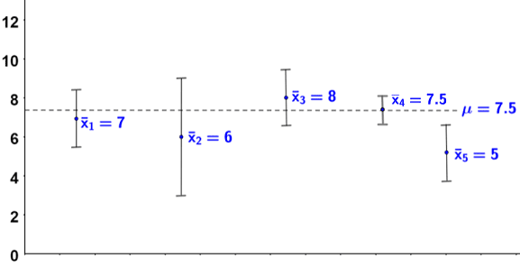

# Best Practices for Performance Testing

## 1. Check the results 

Before presenting or visualizing your results, always verify their theoretical plausibility. Perform a basic sanity check to ensure your metrics are logically and physically possible (e.g., verifying that network throughput doesn't magically exceed the physical line-rate, or that execution times align with hardware clock limits).

## 2. Execution Time Testing
When measuring the execution time of scripts or compiled programs, ensuring reliability and minimizing system noise is crucial.

### Data Collection & Statistics
A single run is never enough due to OS background tasks and cache states. Run multiple iterations to gather statistically significant data. Key metrics to record:
- **Min:** The fastest execution time. This is often the closest to the true algorithmic limit, as it suffered the least system interruption.
- **Max:** The slowest execution time. Useful for identifying worst-case scenarios or cold-cache penalties.
- **Mean (Average):** The overall average time across all runs.
- **Median (50th Percentile):** The middle value. This is often more reliable than the mean because it is less skewed by extreme outliers caused by sudden OS spikes.
- **Standard Deviation:** Shows the variance in your runs. A high deviation ns: The exact, step-by-step terminal commands required to compile and run the benchmark scriptsExecutionmeans your test environment is noisy and unstable.
- **Confidence Interval (e.g., 95%):** The range within which you can be 95% certain the true mean lies.

### Data Representation
Choose the right visual representation for your audience:

- **Tables:** Best for comparing exact numbers and statistics side-by-side.

| Algorithm | Min (ms) | Max (ms) | Mean (ms) | Median (ms) | Std Dev (ms) | 95% Conf. Interval |
| :--- | :---: | :---: | :---: | :---: | :---: | :---: |
| **Baseline** | 12.45 | 18.92 | 14.12 | 13.98 | 1.12 | [13.90, 14.34] |
| **Optimized** | 8.12 | 12.05 | 9.45 | 9.32 | 0.85 | [9.28, 9.62] |
| **Hardware Accel.** | 2.01 | 4.56 | 2.34 | 2.15 | 0.42 | [2.26, 2.42] |


- **Plots (e.g., Boxplots, Bar charts with Error Bars):** Best for showing distribution, variance, and confidence intervals at a glance. Tools like Matplotlib or Seaborn in Python are excellent for generating these.
  

### Maximizing Speed & Minimizing Noise
To get accurate performance metrics, you need to isolate your process:
- **Warm-up Runs:** Always perform a few "dummy" iterations before starting your timer. This ensures the CPU cache is populated and memory pages are loaded.
- **Isolate Execution:** Run your scripts strictly sequentially. Close heavy background applications to minimize system noise. Keep in mind that launching scripts in separate terminal windows still results in concurrent execution and resource contention at the OS level. Always wait for one test process to finish completely before starting the next.
- **CPU Pinning (Advanced):** For highly sensitive tests, consider binding your execution to a specific CPU core (e.g., using `taskset` on Linux) to prevent context-switching overhead.
- **Aggressive Compilation:** Ensure you are compiling your code with maximum optimization flags and without debug symbols. For C++, use:

```bash 
g++ -O3 -march=native -DNDEBUG your_script.cpp -o your_script
```
## 3. Reproducibility

For your results to be scientifically credible, others must be able to replicate them. Always include a section detailing the exact test environment:

- **Hardware**: Device type, CPU model, and available RAM (e.g., Raspberry Pi 4 Model B, 8GB RAM).

- **Software/OS**: Operating System, Kernel version (very important for system-level testing), and compiler version (e.g., Ubuntu 22.04, Linux kernel 6.5, GCC 11.4).

- **Algorithms**: A brief description of the specific algorithms or parameters being evaluated.

- **Run Instructions**: The exact, step-by-step terminal commands required to compile and run the benchmark scriptsExecution